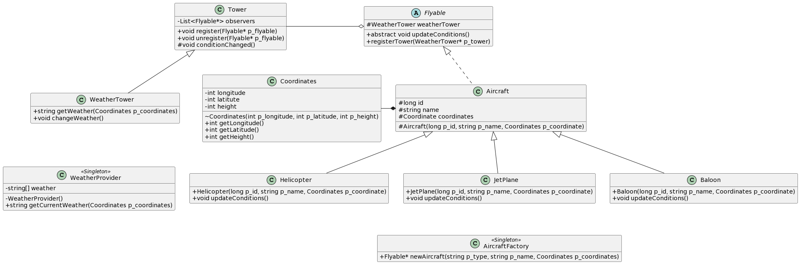

## Compile with
```
$find * -name "*.java" > sources.txt
$javac @sources.txt
```
## Run with
```
java ro.academyplus.avaj.simulator.Simulator scenario.txt
```

## Scenario File
The first line represents how many times the simulation runs and the number of times a wwather change is triggered.

Other lines reprensent:
```
 TYPE NAME LONGITUDE LATITUDE HEIGHT
```

## Weather generation
• RAIN
• FOG
• SUN
• SNOW


# Avaj-Launcher — UML & Patterns



---

## 1. How to Read the Diagram

### Class boxes

Each box has three compartments:

```
┌─────────────────┐
│   ClassName     │  ← name (italic = abstract, «Singleton» = stereotype)
├─────────────────┤
│  attributes     │  ← fields
├─────────────────┤
│  operations     │  ← methods
└─────────────────┘
```

### Visibility markers

| Symbol | Meaning |
|---|---|
| `+` | public |
| `-` | private |
| `#` | protected |
| `~` | package-private |

Example from the diagram: `#WeatherTower weatherTower` on `Flyable` is a **protected** field — accessible to subclasses (`Aircraft`, and through it `Helicopter`, `JetPlane`, `Baloon`).

Italic names (like *Flyable*) mean the class is **abstract**: it cannot be instantiated directly.

### Arrows between classes

| Arrow | Name | Meaning |
|---|---|---|
| ───▷ (solid, hollow triangle) | **Inheritance** | "is-a". Subclass points to parent. |
| ┄┄▷ (dashed, hollow triangle) | **Realization** | Implements an abstract type / interface. |
| ───◆ (solid, filled diamond) | **Composition** | "owns". The part dies with the whole. |
| ───◇ (solid, hollow diamond) | **Aggregation** | "has-a", but the part can outlive the whole. |
| ─── (plain line) | **Association** | A general "knows about" link. |

### Where these show up in the diagram

- `Helicopter`, `JetPlane`, `Baloon` ───▷ `Aircraft` ───▷ `Flyable` — **inheritance chain**.
- `WeatherTower` ───▷ `Tower` — **inheritance**.
- `Aircraft` ┄┄▷ `Flyable` on the dashed arrow — realization of the abstract contract.
- `Aircraft` ───◆ `Coordinates` — **composition**: every aircraft owns its coordinates; if the aircraft is destroyed, its coordinates go with it.
- `Tower` ─── `Flyable` — plain association: the tower keeps a list of flyables it notifies.

---

## 2. The Patterns

### 🛰 Observer Pattern

**Idea.** One object (the *subject*) maintains a list of dependents (*observers*) and notifies them automatically when its state changes. Decouples the "thing that changes" from the "things that care about the change".

**Roles:**
- Subject — keeps observers, exposes `register` / `unregister` / `notify`.
- Concrete Subject — holds the actual state and triggers notification.
- Observer — abstract; declares an update method.
- Concrete Observer — reacts to the update.

**Where it is in this project:**

| Role | Class |
|---|---|
| Subject | `Tower` — holds `List<Flyable*> observers`, exposes `register`, `unregister`, `conditionChanged` |
| Concrete Subject | `WeatherTower` — calls `conditionChanged()` from inside `changeWeather()` |
| Observer | `Flyable` — abstract `updateConditions()` |
| Concrete Observers | `Helicopter`, `JetPlane`, `Baloon` — each implements `updateConditions()` its own way |

**Flow to trace on the diagram:**
1. An aircraft calls `registerTower(weatherTower)` → the tower adds it to `observers`.
2. Simulation loop calls `weatherTower.changeWeather()`.
3. That triggers `conditionChanged()` (inherited from `Tower`).
4. `conditionChanged()` iterates over `observers` and calls `updateConditions()` on each.

---

### 🏭 Factory Pattern

**Idea.** Centralize object creation in a dedicated class so callers don't need to know the concrete types. You ask for "a Helicopter" by name and get back an abstract type (`Flyable*`), so the rest of the code stays decoupled from the concrete class hierarchy.

**Where it is in this project:**

- `AircraftFactory` with the method `newAircraft(string p_type, string p_name, Coordinates p_coordinates) : Flyable*`.
- Look at the `Aircraft` box: the constructor is `#Aircraft(...)` — **protected**. That's the enforcement mechanism. Nothing outside the hierarchy can call `new Helicopter(...)` directly, so the factory is the *only* legitimate entry point for creating aircraft.
- The factory returns `Flyable*` (not `Helicopter*`), so client code depends only on the abstract type.

**Trade-off it solves.** Adding a new aircraft type (say, `Glider`) only requires: creating the subclass, and adding one branch in `AircraftFactory::newAircraft`. Nothing else in the codebase needs to change.

---

### 👤 Singleton Pattern

**Idea.** Guarantee that a class has exactly **one** instance, and provide a global access point to it. Used for services where multiple instances would be nonsensical or inconsistent.

**How you spot it on the diagram:** the `«Singleton»` stereotype above the class name, plus a **private constructor** (`-WeatherProvider()`).

**Where it is in this project:**

| Class | Why it's a singleton |
|---|---|
| `WeatherProvider` | Weather must be globally consistent — every aircraft querying the same coordinates must get the same answer. |
| `AircraftFactory` | Creation logic is stateless and centralized; no reason to have more than one. |

**Enforcement pattern (typical shape):**
```
- private constructor          → forbids `new WeatherProvider()` from outside
- private static instance      → the single instance
- public static getInstance()  → the global access point
```
